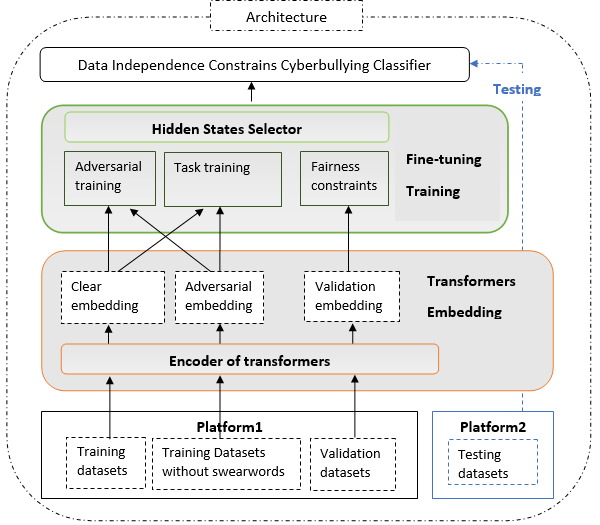
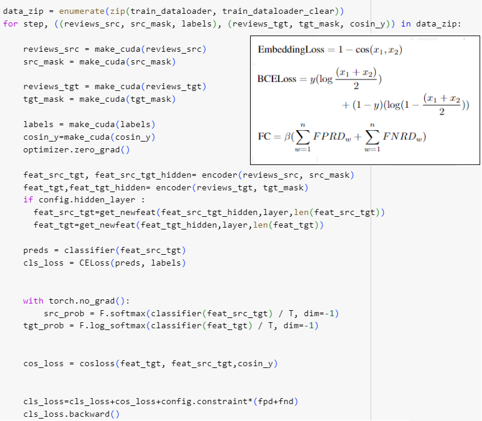

# ID-XCB: Data-independent Debiasing for cyberbullying detection
Implementation of paper: ID-XCB: Data-independent Debiasing for Fair and Accurate Transformer-based Cyberbullying Detection

## Main idea and implementation
We combine the three training losses to fine-tune a classifier. Adversarial training(**Embedding loss**) and task training(**BCELoss**) optimise ID-XCB model parameters on a training dataset and simultaneously enforce the fairness constraints(**FC**) on a validation set to reduce swear word impact.

## Datasets 
#### Instagram cyberbullying detection datasets （Need to request from the dataset author）
Homa Hosseinmardi, Sabrina Arredondo Mattson, Rahat Ibn Rafiq, Richard Han, Qin Lv, and Shivakant Mishra. 2015. **Analyzing labeled cyberbullying incidents on the instagram social network**. In _Socinfo_. Springer, 49–66.
#### Vine cyberbullying detection datasets （Need to request from the dataset author）
Rahat Ibn Rafiq, Homa Hosseinmardi, Richard Han, Qin Lv, Shivakant Mishra, and Sabrina Arredondo Mattson. 2015. **Careful what you share in six seconds: Detecting cyberbullying instances in Vine**. In _ASONAM_. ACM, 617–622.
#### Swear lexicon_1 (Publicly available)
Agrawal S, Awekar A. 2018 Mar 1. **Deep learning for detecting cyberbullying across multiple social media platforms**. In European conference on information retrieval 2018 Mar 1 (pp. 141-153). 
#### Swear lexicon_2 (Publicly available)
We use Google bad words lists[https://code.google.com/archive/p/badwordslist/downloads]

### Python package version
* pandas==2.0.3
* scikit_learn=1.2.2
* torch==2.2.2
* numpy==1.25.2
* transformers==4.40.0
* datasets==2.18.0
* accelerate==0.29.3
* evaluate==0.4.1
* bitsandbytes==0.43.1
* huggingface_hub==0.22.2
* trl==0.8.6
* peft==0.10.0r,val_dataloader,test_dataloader,X_train,Y_train
